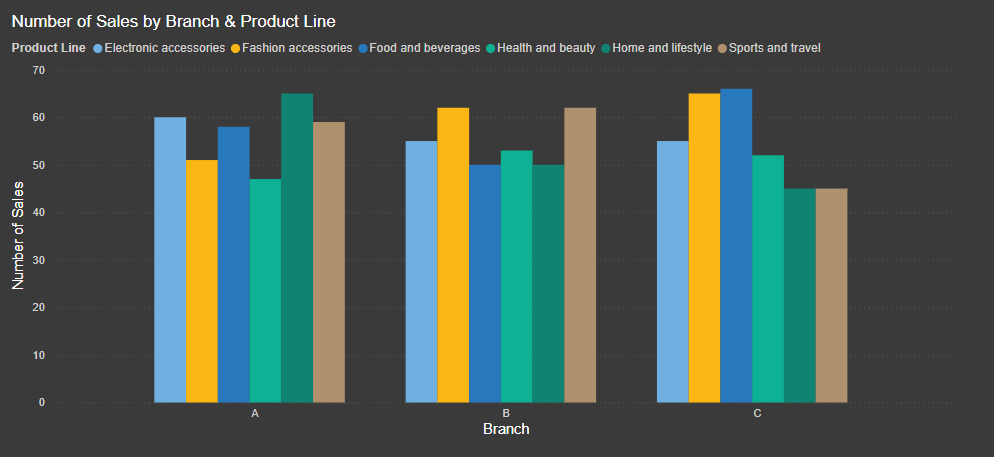
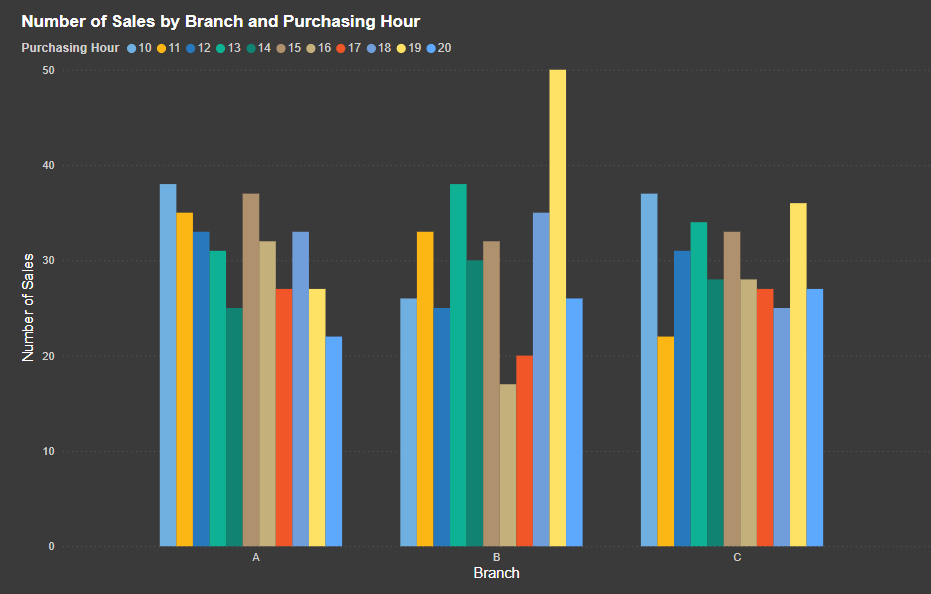
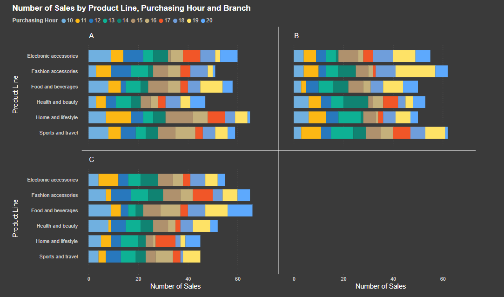
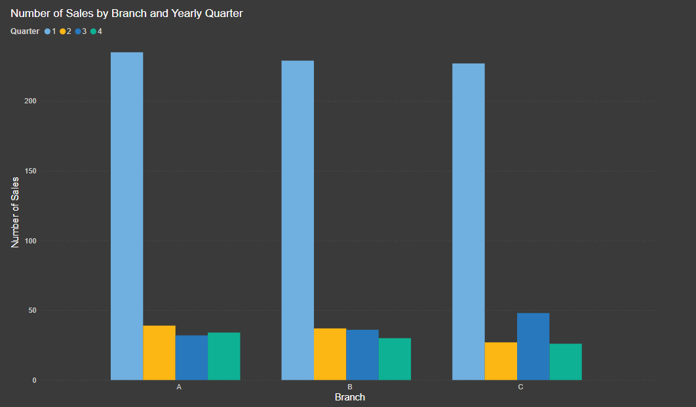
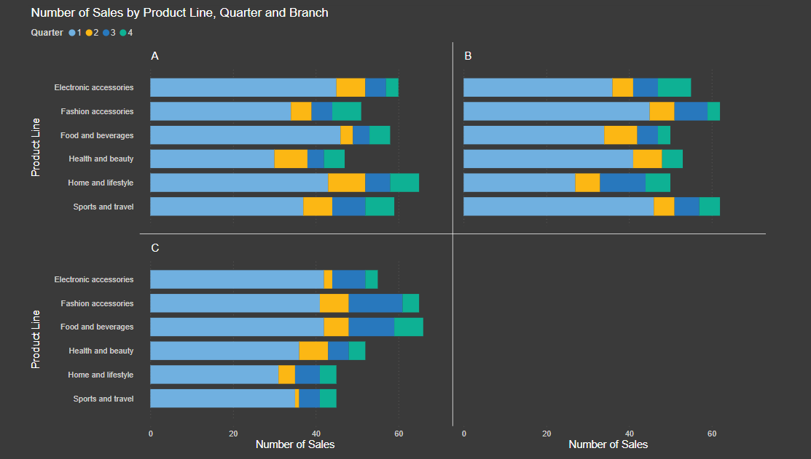
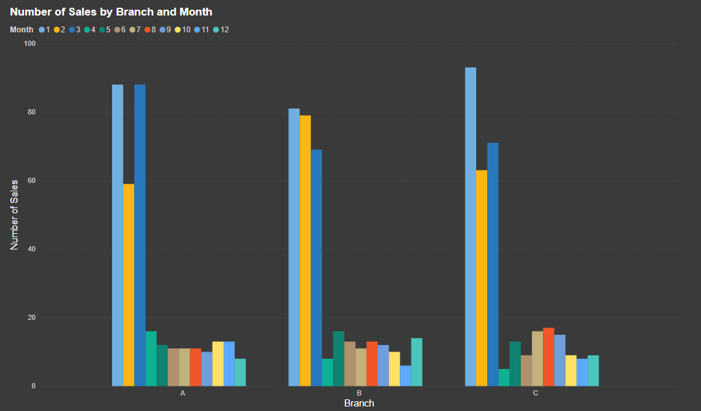
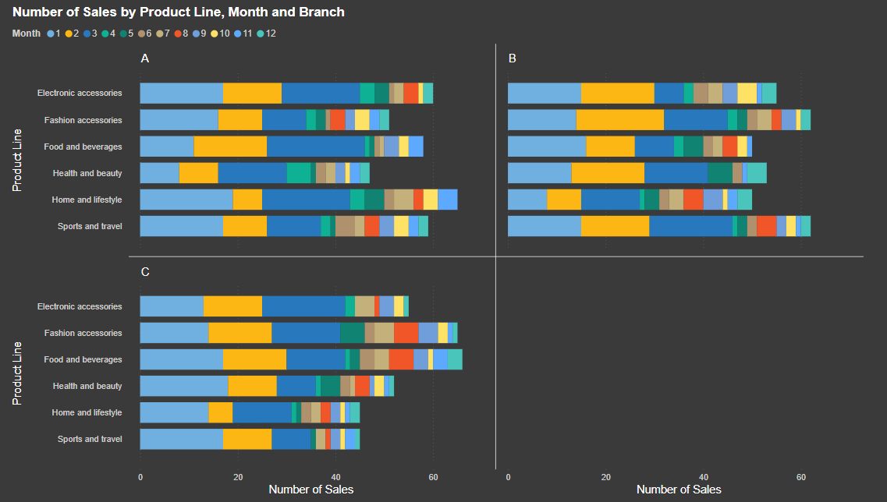

# Executive Summary
This project explores retail sales data from a supermarket company, using a 2023 dataset from Kaggle that tracks historical sales data from three different branches. The dataset offers detailed insights into various sales aspects, such as purchase time and date, sales performance across different product lines, and more. 

The goal is to provide branch-specific actionable recommendations to boost sales performance by discovering the key periods for high sales, identifying in-demand product lines, and grasping the unique sales trends across difference branches. 

The findings are organised into three main strategies: “Staffing and Inventory Management,” “Targeted Promotions,” and “Product Placement.” Each strategy is designed to leverage high-performing products during peak sales periods. Navigate to [Actionable Recommendations](#Actional-Recommendations) for a more detailed explanation.

# SQL Query Analysis
1. Financial Performance 
2. Sales Performance
3. Transaction Value 
4. Time-Series Analysis

The combined insights from these analyses can provide valuable, actionable recommendations to optimise financial performance, enhance sales strategies, improve transaction value, and leverage time-series trends for better decision-making.

For SQL queries, please navigate here: [project_sql folder](/project_sql/)

# Software and Tools
- SQL: CTEs, Subqueries, Aggregate Functions, ETL
- Power BI: Data Visualisations
- Visual Studio Code
- Git & GitHub

# The Analysis
### 1. Financial Performance
This analysis encompasses various metrics related to the profitability of the supermarket, including total revenue, revenue by branch, total gross profit, and gross profit by branch.

| Branch |  Revenue ($)     | 
|--------|--------------------|
| A      | 106,200.37         |
| B      | 106,197.67         |
| C      | 110,568.71         |
| **Total** | **322,966.75**  |

*Table of the total revenue by branch.*

| Branch | Gross Profit ($) |
|--------|-----------------|
| A      | 5,057           |
| B      | 5,057           |
| C      | 5,265           |
| **Total**  | **15,379**       |

*Table of the total gross profit by branch.*

Here's the breakdown:

- Branch C has the highest revenue and gross profit among the three branches.

- Branches A and B have nearly identical revenues. This suggests a fairly uniform distribution of revenue with a slight outlier (Branch C)

- All branches have a gross profit margin of approximately 4.76%.

### 2. Sales Performance

This analysis focuses on the performance of different product lines, providing insights into which products are generating the most sales overall and within each branch.

*A clustered bar chart displaying the number of sales by branch and product line.*

Here's the breakdown:

- Branch A has the highest total sales among the three branches with a total of 340.

- Branch B and Branch C have nearly identical total sales with 332 and 328 respectively. This indicates a uniform distribution of sales between these two branches.

- Overall Top-Selling Product Line: Fashion Accessories is the most popular product line across all branches, with a total of 178 sales.

- **Top-Selling Product Lines by Branch:**

    - Branch A: Home and Lifestyle leads with 65 sales.
    - Branch B: Sports and Travel leads with 62 sales.
    - Branch C: Food and Beverages leads with 66 sales.

- **Product Line Popularity:**

    - Fashion Accessories: Most popular overall with 178 sales.
    - Electronic Accessories: Second most popular overall with 170 sales.
    - Home and Lifestyle: Most popular in Branch A.
    - Sports and Travel: Most popular in Branch B.
    - Food and Beverages: Most popular in Branch C.

### 3. Transaction Value

This analysis includes metrics related to the average amount spent per transaction, providing insights into customer spending behavior across the supermarket and within individual branches.

| Branch | Average Transaction Value ($) |
|--------|---------------------------------|
| A      | 312.35                          |
| B      | 319.87                          |
| C      | 337.10                          |

*Table of the average transaction value by branch.*

Here's the breakdown:

- Branch C has the highest average transaction value among the three branches with a value of 337.10.

- Branch A has the lowest average transaction value with a value of 312.35.

- Branch B has an average transaction value that is in the middle, with a value of 319.87.

-  The overall average transaction value of 322.97 indicates that all branches are performing close to this value.

### 4. Time-Series Analysis
Time-series analysis of both sales volume and revenue involves examining sales data across different time periods, such as times of day, months, and quarters, and how these vary by branch and product line. This allows for a comparison of sales volume and revenue trends over time, across different branches and product lines.

***Note: Both the number of sales and the revenue generally follow a similar pattern throughout the hours of the day. Therefore, I have chosen to focus and display only the Sales data.***

---
### Peak Sales Time

*A clustered bar chart showing the number of sales by branch and purchasing time. This is used to compare the number of sales across different branches (A, B, C) at various purchasing hours. Each branch is represented by groups of bars, each color-coded to correspond to a specific hour of the day.*

*Stacked horizontal bar charts showing the number of sales by product line, branch, and purchasing time. This type of chart displays the breakdown of different product lines within a larger category (Branch A, B, C) for each time segment. Each bar represents a total value (number of sales), segmented into different colors that represent various product lines*

**Branch-specific Peaks:**
- Branch A: Peaks at 10:00 AM, indicating that morning is a crucial time for sales. This suggests that customers prefer shopping in the mid-morning hours.
- Branch B: Peaks at 7:00 PM, indicating a different customer behavior pattern compared to Branch A, with a preference for evening shopping, possibly after work.
- Branch C: Peaks at 10:00 AM, similar to Branch A, indicating that morning hours are crucial for sales in this branch as well.

**Product Line Contributions:**
- Branch A:
    - "Home and Lifestyle" products contribute significantly to peak times, especially around 11:00 AM and 3:00 PM, indicating mid-morning and afternoon shopping preferences.
    - "Electronic Accessories" and "Food and Beverages" show significant contributions throughout the day, with distinct peaks in the morning and late afternoon.

- Branch B:
    - "Sports and Travel" products significantly contribute to the evening peak at 7:00 PM, indicating a preference for evening shopping.

- Branch C:
    - "Food and Beverages" are the top contributors to the evening peak at 7:00 PM, indicating high demand during this time.

**Customer Behavior:**
- Branch A and C: Customers prefer morning shopping for "Electronic Accessories," aligning with the overall peak times.
- Branch B: Evening peak suggests customers prefer shopping after work or later in the day, indicating a different shopping behavior compared to Branch A and C.

---
### Peak Sales by Yearly Quarter

*A clustered bar chart showing the number of sales by branch across different yearly quarters. This compared the total number of sales for each branch (A, B, C) segmented by quarters. Each color within a bar represents a different quarter.*

*Stacked horizontal bar charts segmented by product line for each branch (A, B, C), and further broken down by quarterly sales data. Each color represents a different quarter.*

Here's the breakdown:
- **Branch A:** Q1 is the peak for both revenue and sales, with major contributions from "Home and lifestyle," "Food and beverages," and "Electronic accessories." Customer behavior shows a preference for "Food and beverages" and "Electronic accessories."
- **Branch B:** Q1 is the peak for both revenue and sales, with significant contributions from "Health and beauty," "Electronic accessories," and "Sports and travel." Customers prefer "Sports and travel" and "Fashion accessories."
- **Branch C:** Q1 is the peak for both revenue and sales, with high contributions from "Electronic accessories," "Fashion accessories," and "Food and beverages." Customer behavior indicates a preference for "Electronic accessories" and "Food and beverages."
---
### Peak Sales by Month

*A clustered bar chart showing the number of sales by branch and month. Each group of bars represents one of the branches (A, B, C), with individual bars colored differently to correspond to each month of the year.*

*A series of stacked horizontal bar charts segmented by product line for each branch (A, B, C), and further broken down by monthly sales data. Each color represents a different month.*

**Branch-specific Peaks:**	
- Branch A: Peaks in March, indicating a preference for shopping during early spring.
- Branch B: Peaks in December, suggesting a preference for shopping during the holiday season.
- Branch C: Peaks in November, similar to Branch B, suggesting that late autumn and early winter are crucial for sales as well. 

**Product Line Contributions:**	
- Branch A:
	- "Home and Lifestyle" products peaks in March and January, indicating that customers have a preference for shopping during the early spring and the new year.
	- "Food and Beverages" products make significant contributions throughout the year, with distinct peaks in March, suggesting consistent demand with a notable increase in early spring.
- Branch B:
	- "Sports and Travel" products see significant contributions in December, indicating that customers prefer to shop for these items during the holiday season.
- Branch C:
	- "Food and Beverages" products makes major contributions in November, indicating high demand during the late autumn months.

**Customer Behavior:**
- Branch A and C:
	"Electronic Accessories" items are preferred by customers in the early months of the year, aligning with the overall peak times for these branches.
- Branch B:
	Customers at this branch show a preference for shopping during the holiday season, indicating a different shopping behavior compared to customers at Branch A and C.

# Actionable Recommendations 
Here are some data-driven recommendations to improve sales performance across branches, categorised into three key areas:

1. Staffing and Inventory Management: 
    - Optimise Staffing Levels: Ensure adequate staff during peak times to reduce customer wait times and improve customer service.
2. Targeted Promotions:
    - Align Promotions with Peak Hours: Schedule special offers during peak times to maximise sales.
    - Seasonal Marketing Campaigns: Focus on top-performing product lines during peak months with targeted marketing efforts.
3. Product Placement:
    - Showcase Seasonal Products: Prominently display high-demand products during the peak season to attract customer attention and boost sales.

### Branch A
Targeted Promotions: 

- Launch campaigns focused on “Home and lifestyle” and “Electronic accessories” products during January and March. These periods align well with early spring and New Year promotional events.
- Optimal times for these campaigns are mid-morning (10 AM to 12 PM) and late afternoon (3 PM to 5 PM).

Staffing and Inventory Management: 

- Increase staffing levels during peak hours (10 AM and 3 PM) and months (January and March)
- Ensure high stock levels for Home and lifestyle, Electronic accessories, and Food and Beverages during peak time periods.

Product Placement: 

- Position Home and Lifestyle and Electronic Accessories products at the front of the store and near checkout areas during peak time periods.
- Place these items near complementary products, and offer bundle deals and discounts.

### Branch B
Targeted Promotions: 

- Launch campaigns focused on “Home and lifestyle” and “Electronic accessories” products during February and April. These periods align well with Lunar New Year and Easter promotional events.
- Optimal times for these campaigns are noon (12 PM to 2 PM) and late afternoon (4 PM to 6 PM).

Staffing and Inventory Management: 

- Increase staffing levels during peak hours (7 PM) and months (February and April).
- Ensure high stock levels for “Food and Beverages” and “Home and Lifestyle” during these peak time periods.

Product Placement: 

- During these peak time periods, position “Food and Beverages” and “Home and Lifestyle” products at the front of the store and near checkout areas.
- Place these items near complementary products, and offer bundle deals and discounts.

### Branch C

Targeted Promotions: 

- Launch campaigns focused on “Health and Beauty” and “Sports and Travel” products during May and June. These periods align well with Mother’s and Father’s day promotional events.
- Optimal times for these campaigns are early afternoon(11 AM to 1 PM) and evening (5 PM to 7 PM).

Staffing and Inventory Management: 

- Increase staffing levels during peak hours (10 AM and 7 PM) and months (February and April).
- Ensure high stock levels for “Health and Beauty” and “Sports and Travel” during these peak time periods.

Product Placement: 

- During these peak time periods, position “Health and Beauty” and “Sports and Travel” products at the front of the store and near checkout areas.
- Place these items near complementary products, and offer bundle deals and discounts.